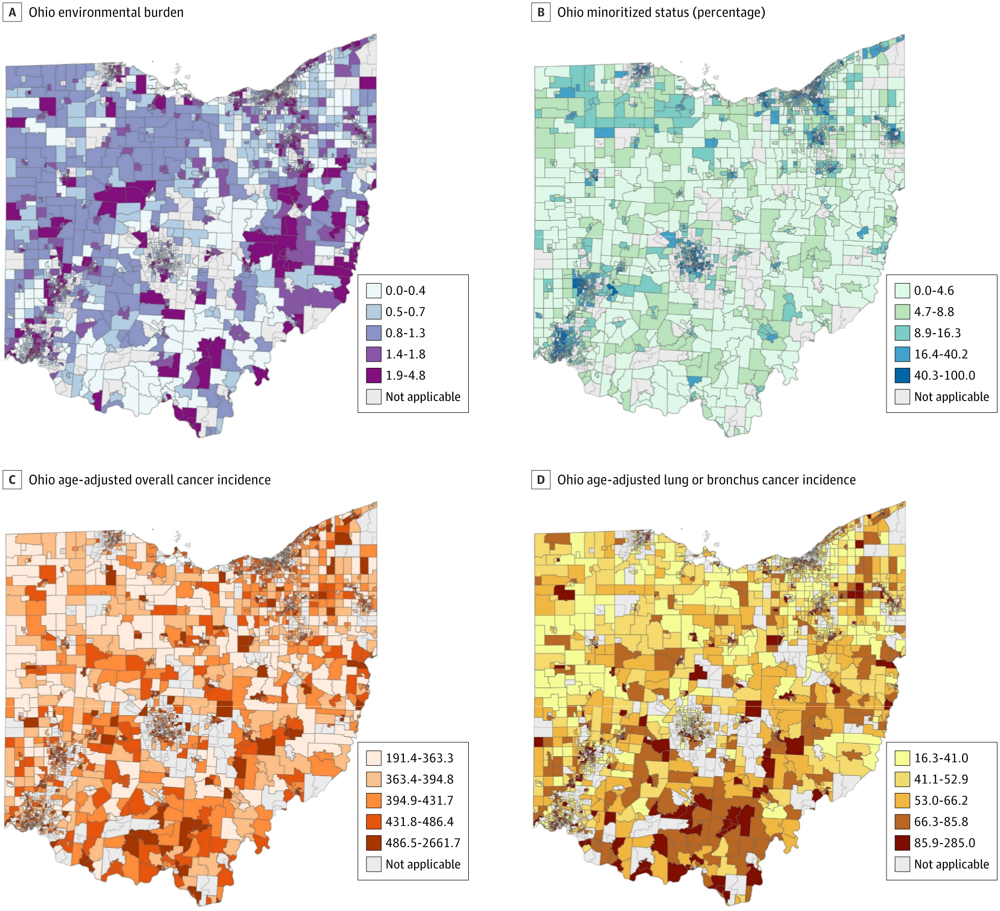
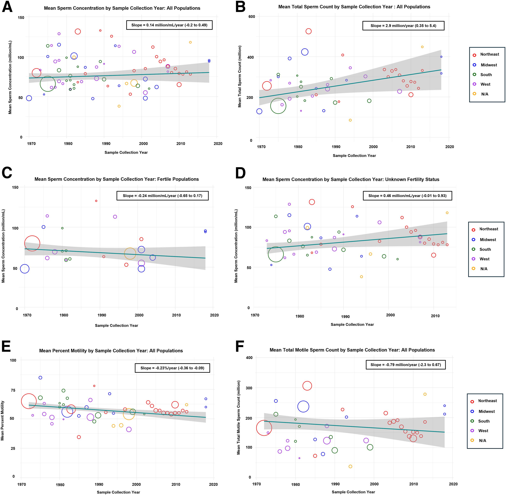
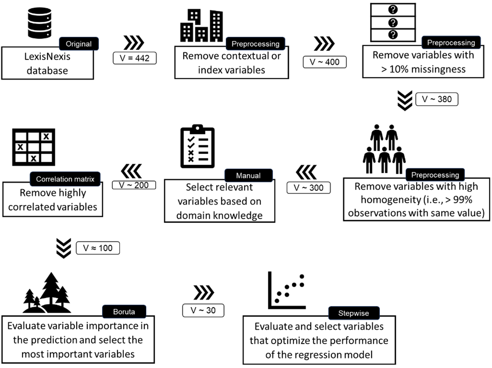
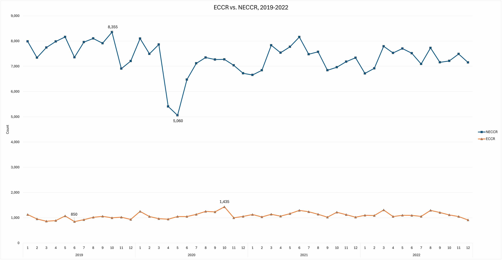
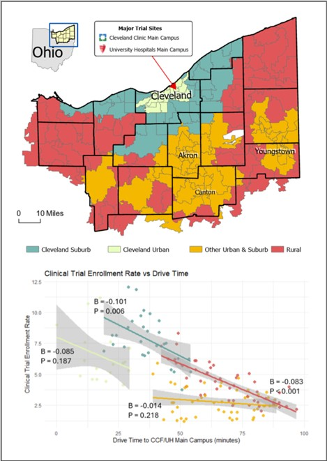
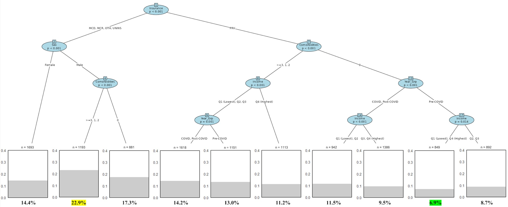

 

## Manuscript

### Cancer Burden in Neighborhoods With Greater Racial Diversity and Environmental Burden

- Bobbitt JR, Liu F, Keri RA, Cullen J. Cancer Burden in Neighborhoods With Greater Racial Diversity and Environmental Burden. *JAMA Netw Open*. 2025;8(6):e2516740. doi:10.1001/jamanetworkopen.2025.16740
- **Link**: <https://jamanetwork.com/journals/jamanetworkopen/fullarticle/2835508>

----

### Sperm concentration remains stable among fertile American men: a systematic review and meta-analysis

- Lewis, K., Cannarella, R., Liu, F., Roth, B., Bushweller, L., Millot, J., Sohei Kuribayashi, Kuroda, S., Palacios, D. A., Vij, S. C., Cullen, J., & Lundy, S. D. (2024). Sperm Concentration Remains Stable Among Fertile American Men: A Systematic Review and Meta-Analysis. *Fertility and Sterility*. doi:10.1016/j.fertnstert.2024.08.322
- **Link**: <https://www.fertstert.org/article/S0015-0282(24)01953-8/fulltext>

----

### Methodological considerations for optimal variable selection in machine learning for health services research

- Dong, W., Lal, T., Liu, F. et al. Methodological considerations for optimal variable selection in machine learning for health services research. *Health Serv Outcomes Res Method* 2025, 474–486 (2025). doi:10.1007/s10742-025-00347-8
- **Link**: <https://doi.org/10.1007/s10742-025-00347-8>

----

### National trends in emergency and non-emergency colorectal cancer resections across the COVID-19 pandemic

- Lal, T., Kang, C. O., Liu, F., Cabulong, A., Hoehn, R. S., Rose, J., & Koroukian, S. M. National trends in emergency and non-emergency colorectal cancer resections across the COVID-19 pandemic. *Surgical Oncology Insight*, 2025, 3(1), 100197–100197. doi:10.1016/j.soi.2025.100197
- **Link**: <https://www.surgoncinsight.org/article/S2950-2470(25)00093-3/fulltext>

----

### Brief Report: Real-World Outcomes in Patients living with HIV with Lung Cancer treated with Immune Checkpoint Inhibitors

- Hsu, M. L., Liu, F., Kyasaram, R. K., Zhong, J., & Dowlati, A. (2026). Brief Report: Real-World Outcomes in Patients living with HIV with Lung Cancer treated with Immune Checkpoint Inhibitors. *JTO Clinical and Research Reports*, 100982. doi:10.1016/j.jtocrr.2026.100982
- **Link**: <https://doi.org/10.1016/j.jtocrr.2026.100982>

----

### Mapping Cancer Clinical Trial Deserts: Travel Burden and Financial Toxicity in Participation

- Dong W, Shoag J, Kindwall-Keller T, Liu F, Li S, Kara AM, Al-Kindi S, Cullen J, Mukherjee S, Rose J, Koroukian SM, Hoehn RS. Mapping Cancer Clinical Trial Deserts: Travel Burden and Financial Toxicity in Participation. *Annals of Oncology*. Accepted for publication. 2026.

----

### Age-Stratified Risk Profiles for Emergency Colorectal Cancer Resection: A Machine Learning Analysis

- Lal T, Liu F, Cabulong A, Kang CO, Hoehn RS, Rose J, Koroukian SM. Age-Stratified Risk Profiles for Emergency Colorectal Cancer Resection: A Machine Learning Analysis. *Journal of Gastrointestinal Surgery*. Accepted for publication. 2026.

----

## Conference Abstracts

- Davis, L. E., Liu, F., Dong, W., Rose, J., Koroukian, S., & Vince, R. (2025). Early onset prostate cancer: A complex interplay between race, poverty, and incidence [Abstract]. The Journal of Urology, 213(5_Supplement), PD18-08.

- Zhong, J., Liu, F., Kaur, J., Zhang, A., Zablonski, K., Chahine, R., Trinh, I., Wang, Q., Brister, L., & Hsu, M. (2025). Comprehensive assessment of provider perspectives of cancer survivorship needs. Supportive Care in Cancer, 33(Suppl 1), S384.

- Hsu, M. L., Liu, F., Kyasaram, R. K., Zhong, J., & Dowlati, A. (2025). Real-world outcomes in patients living with HIV with lung cancer and treated with immune checkpoint inhibitors. Journal of Clinical Oncology, 43(16_suppl), 11156–11156.

- Seitz, E., Liu, F., Chi, W., Rao, R., Gong, J., Prasad, S., ... Wang, Q. (2025, September). Effect of social determinants of health on lung cancer screening uptake in the US. World Conference on Lung Cancer (WCLC) 2025, Boston, MA, USA.

- Gong, J., Wen, C., Guo, E., Xie, H., Jiang, C., Liu, F., Hsu, M., & Wang, Q. (2025, October). The influence of social determinants of health on vaccination uptake in cancer survivors in the United States. ASCO Quality Care Symposium 2025, Boston, MA, USA.

- Kailar, R., Liu, F., Yammani, D., Raghuwanshi, Y., Dowlati, A., Hsu, M. L., Wang, Q., Mirsky, M., & Chiec, L. (2025, September). Disparities in lung cancer treatment for older adults. World Conference on Lung Cancer (WCLC) 2025, Boston, MA, USA.

- Cullen, J., Liu, T., Hartman, H., Liu, F., Alfahmy, A., Ghosh, R., ... & MacLennan, G. (2024). Joint roles of proteomics and neighborhood-level social determinants of metastatic prostate cancer. Cancer Epidemiology, Biomarkers & Prevention, 33(9_Supplement), A039.

- Bobbitt, J. R., Liu, F., Cullen, J., & Keri, R. A. (2024). Assessment of racial and ethnic disparities in environmental exposure-related cancer burden. Cancer Research, 84(6_Supplement), 853.

----

## Manuscript Under Review

- Apte, T., Liu, F., Cullen, J., & Ghosh, R. (2025). Investigating the impact of social determinants of health on the incidence of pediatric cancer in the United States. (Under review at JAMA Pediatrics)

- Cullen, J., Liu, T., Hartman, H., Liu, F., Alfahmy, A., Ghosh, R., ... MacLennan, G. (2025). Joint roles of proteomics and neighborhood-level predictors of de novo metastatic prostate cancer in Black and White men. (Under review at Cancer Cell)

